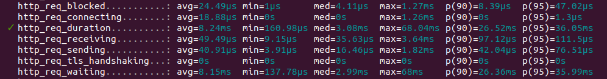
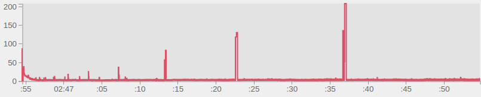
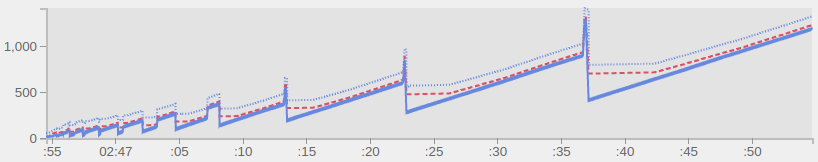
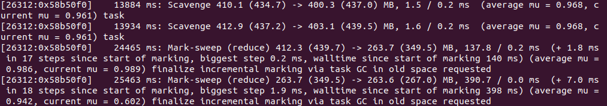
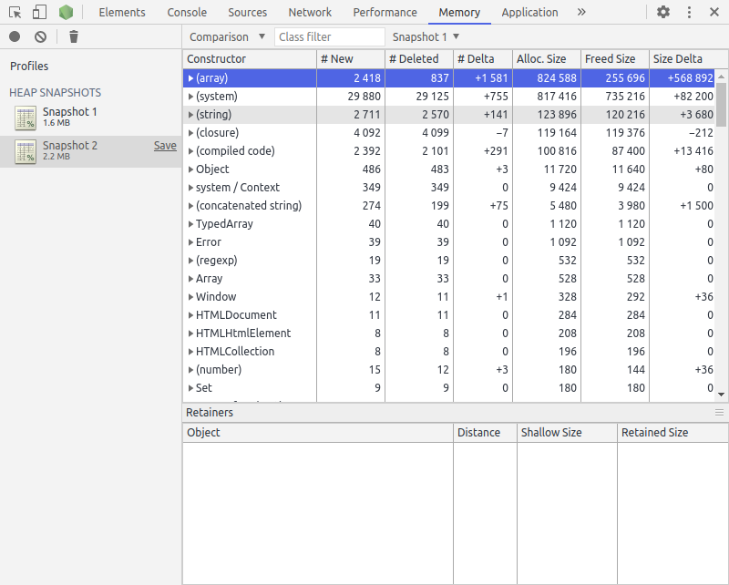

# Detecting NodeJS Garbage Collection issues

Since NodeJS applications are long-running processes and JS is a language with out-of-the-box memory management it's necessary to keep an eye on garbage collection, detect memory leaks and other cases where memory strategy could be improved.

That includes performance testing as part of development process and application monitoring in production (e.g. Prometheus/Grafana).

To identify memory problems we have to collect metrics about event loop lag, resident set size, heap memory and CPU usage.

### Event loop lag

### Heap usage

### Tracing GC

Once problem identified connecting to NodeJS processes with debugging client. Then taking snapshots and comparing snapshots of the heap.
### Heap snapshots

An alternative approach is to generate a code dump, inspect objects in memory and look at the backtrace of a program.
